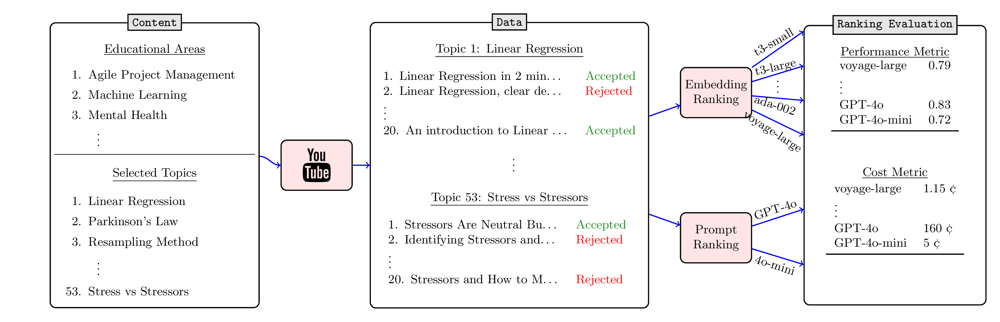

# Investigating the Effectiveness of Large Language Models in Ranking Online Educational Resources

This is the repository for the paper "Investigating the Effectiveness of Large Language Models in Ranking Online Educational Resources" submitted to wsdm 2025. 

## Abstract
As the landscape of online education evolves, the demand for personalized and dynamic learning experiences for learners has be come increasingly apparent. Despite the abundance of educational resources available on the Internet, the challenge lies in identifying high-quality resources, which fit both teachers’ and learners’ needs. With the advent of Large Language Models (LLMs), there is a huge hope in enhancing the discoverability of educational resources. In our latest effort, we proposed a ranking framework, including a dataset of educational resources. With this framework and dataset we investigated how methods using LLM-embeddings are effective in ranking online educational resources based on teachers’ intended subjects. In this paper, we aim at exploring the potential of LLM- prompting methods and comparing the outcome of these methods with the embedding methods. Our investigations highlighted that LLM-prompting methods are able to achieve better results in rank- ing online educational resources according to the accuracy of our pairwise comparison methodology. However, our cost analysis revealed a significant increase in resource consumption which might negatively affect the usage of the LLM-prompting methods.


## Dataset

First, download the dataset from the following URL and extract it into the `data` folder:

[Download Dataset](https://mega.nz/file/zL4UUTCQ#CZJCtR_-Q2sqhSouvBuAPOLaSsOVREfouO-ozCjiYiQ)

or, you can use the following command (Linux command line):

```bash
wget https://www.dropbox.com/scl/fi/x0yebe16xfbdhkxwgy761/wsdm_data.db.gz?rlkey=3v24a41fnml0pbdt8k172g7b8&dl=1 -O data/wsdm_data.db.gz
gunzip data/wsdm_data.db.gz
```

## Preparing the Python Environment

We used Python 3.12 for this project. We highly recommend using [Poetry](https://python-poetry.org/) for dependency management and environment setup. If you already have Poetry configured, you can set up the environment by running the following command:

```bash
poetry install
```

## Running the Code

To replicate the graphs and tables presented in our paper and to explore the results, please refer to the `acm_paper.ipynb` notebook. 

